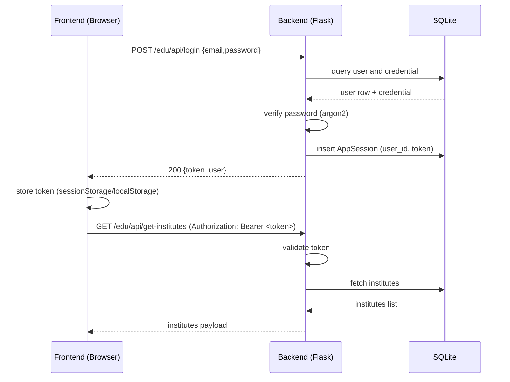
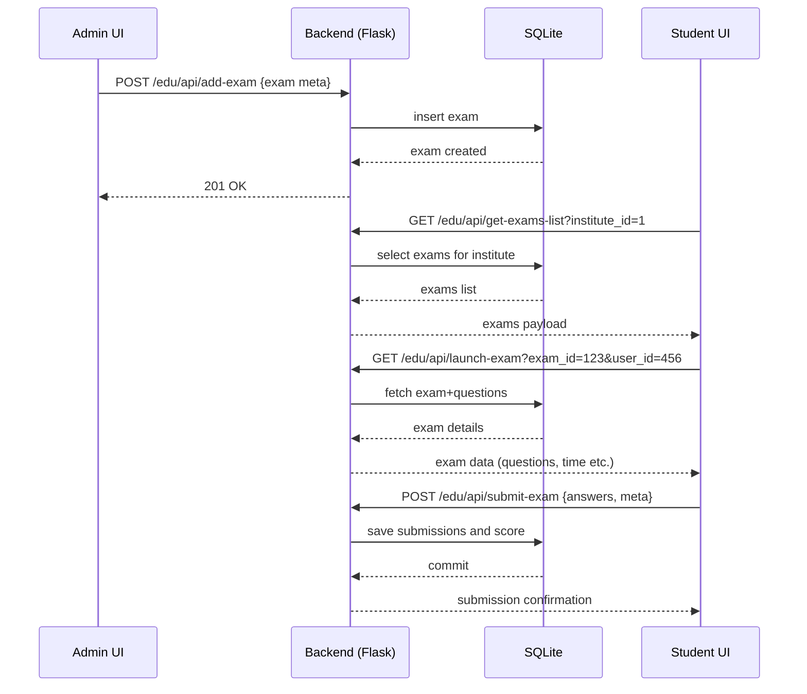

# Diagrams and Flowcharts

This file contains Mermaid diagrams for key flows: Authentication, Exam lifecycle, and Admin institute management. You can paste these into a Mermaid-enabled editor (VS Code Mermaid preview, GitHub markdown, or Mermaid Live Editor) to render diagrams.

## 1) Authentication flow



## 2) Exam lifecycle



## 3) Institute management (view/edit)

```mermaid
flowchart TD
  A[Super-admin UI: View Institutes] -->|GET /edu/api/get-institutes| B[API]
  B --> C[DB]
  C --> B
  B --> A
  A -->|Click View| D[Detail modal]
  D -->|Edit (optional)| E[PUT/POST to /edu/api/register-institute? or /register-institute]
  E --> B
  B --> C
  C --> B
  B --> A
```

## How to render
- Use VS Code Mermaid preview extension, or open on mermaid.live to paste the diagrams.

